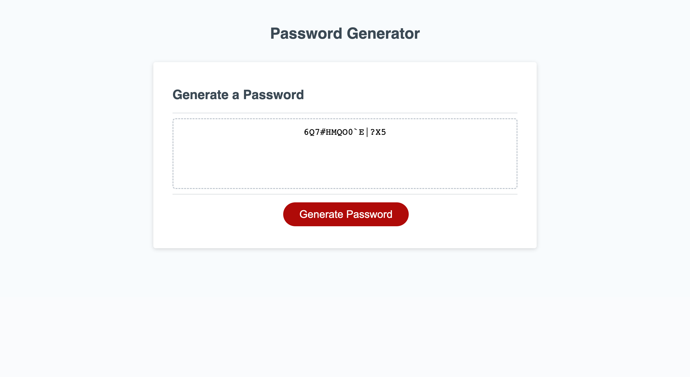

# Madman-Password

## Description
An application that enables employees to generate random passwords based on criteria that they’ve selected.

## Links
* [Github content of Password generator website](https://github.com/JeanSuw/madman-password)
* [Password Page](https://jeansuw.github.io/madman-password/)

## Useage
First you press the red button labels "Generated Password". You must answer all the prompts. The first thing it ask you is the length of your password. Your input should be between 8 to 128, otherwise it will ask you again for the length of your password. Next it will ask you whether or not to include lowercase, uppercase, numeric, and/or special characters as shown in this screenshot below.

This image showed a new password. The length was 15 characters. The user chose to exclude lowercase letters.

Keep in mind that if you cancel the criteria, it will start over from the beginning.

## Acknowledgement
In order to make this website functional, here are the links I searched.

* [JavaScript Document.querySelector()](https://developer.mozilla.org/en-US/docs/Web/API/Document/querySelector)
* [JavaScript Cheatsheet](https://htmlcheatsheet.com/js/)
* [JavaScript String search()](https://www.w3schools.com/jsref/jsref_search.asp)
* [JavaScript String indexOf()](https://www.w3schools.com/jsref/jsref_indexof.asp)
* [JavaScript Window prompt()](https://www.w3schools.com/jsref/met_win_prompt.asp)
* [JavaScript Naming Convension](https://www.syncfusion.com/blogs/post/10-javascript-naming-conventions-every-developer-should-know.aspx)
* [JavaScript toLowerCase](https://developer.mozilla.org/en-US/docs/Web/JavaScript/Reference/Global_Objects/String/toLowerCase)
* [JavaScript Generate Random letters](https://stackoverflow.com/questions/1349404/generate-random-string-characters-in-javascript)
* [JavaScript Arrays](https://www.w3schools.com/js/js_arrays.asp)
* [JavaScript Push, Pop, Shift and Unshift Array Methods](https://www.hackinbits.com/articles/js/push-pop-shift-and-unshift-array-methods-in-javascript)
* [JavaScript add strings](https://zetcode.com/javascript/add-string/#:~:text=The%20easiest%20way%20of%20concatenating,that%20the%20operator%20is%20overloaded.&text=let%20a%20%3D%20'old'%3B,log(c)%3B)
* [Compare Two Strings in JavaScript](https://www.scaler.com/topics/compare-two-strings-in-javascript/)
* [JavaScript Window confirm() Method](https://www.geeksforgeeks.org/javascript-window-confirm-method/)
* [JavaScript Assign Multiple Variables to the Same Value](https://livingwithcode.com/assign-multiple-variables-to-the-same-value-in-javascript/#:~:text=If%20you%20want%20to%20assign,the%20same%20line%20of%20code.)
* [JavaScript Window confirm()](https://www.w3schools.com/jsref/met_win_confirm.asp)